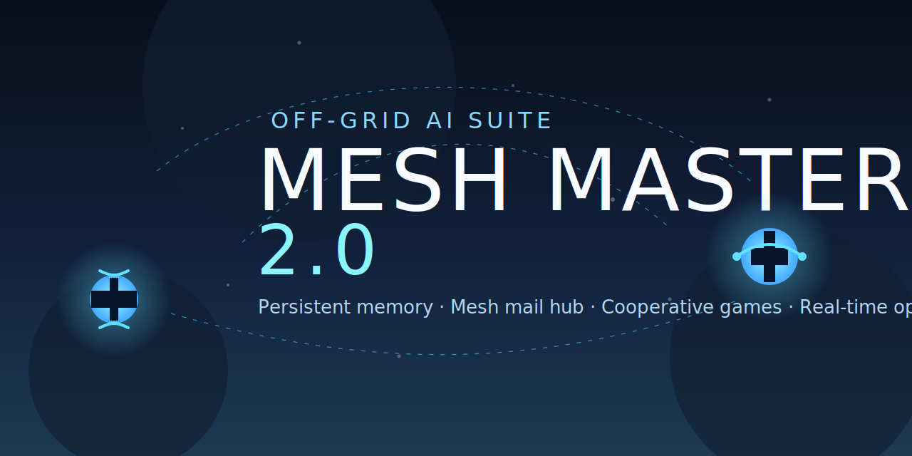

# MESH MASTER v2.0 — Off-Grid AI Operations Suite

**MESH MASTER 2.0** is the next evolution of the Mesh-AI project: a resilient AI copilot for Meshtastic LoRa meshes that remembers conversations, coordinates teams, and keeps the network moving even when the wider internet is gone. Version 2.0 introduces context-aware AI help, offline relay queuing, enhanced privacy controls, URL content filtering, and fuzzy search—all while maintaining the Mesh Mail hub, network bridge relay system, llama-powered games for morale and training, rich offline knowledge, and a comprehensive web command center.

> **Disclaimer**  
> This project is an independent community effort and is **not associated** with the official Meshtastic project. Always maintain backup communication paths for real emergencies.



---

## 2.0 Headline Upgrades
- **Network Bridge Relay with ACK Tracking** — Forward messages to any node by shortname: `snmo hello there` or `/snmo hello there`. Real-time ACK confirmation shows which node acknowledged. Multi-chunk support for long messages. Acts as a bridge across multiple mesh networks—if this node sees networks A and B, users on network A can relay to users on network B seamlessly. **NEW:** Offline message queue stores failed relays and automatically delivers when recipient comes online (up to 3 attempts, 24-hour expiry).
- **Relay Privacy Controls** — `/optout` disables receiving relays (others can't relay to the user), `/optin` re-enables. Privacy preferences persist across reboots and updates in `data/relay_optout.json`.
- **Cross-Network Node Discovery** — `/nodes` lists all nodes seen in the last 24 hours across all channels/networks (sorted newest first). `/node <shortname>` shows detailed signal info (SNR, signal strength, last heard, hops, battery level, power status) with modem-aware thresholds. `/networks` lists all connected channels.
- **Interactive Onboarding** — New users receive a guided 9-step tour via `/onboard` (or `/onboarding`, `/onboardme`) covering the main menu, mesh mail, logs & reports, games, AI assistance, and helpful tools. Fully customizable welcome messages through the dashboard.
- **Private Logs & Public Reports** — `/log` creates private entries visible only to the author; `/report` creates public entries searchable by everyone via `/find`. **NEW:** Fuzzy matching with "Did you mean" suggestions for misspelled names. Command aliases: `/readlog`, `/readlogs`, `/checklog`, `/checklogs` (logs) and `/readreport`, `/readreports`, `/checkreport`, `/checkreports` (reports).
- **Enhanced Privacy & Security** — Message content redacted in all debug/info logs (shows `[X chars]` instead of full text). URL filter blocks adult and warez sites from crawling and search results with humorous error message. All sensitive user data gitignored.
- **Enhanced Dashboard** — Real-time activity feed (20-line mobile-optimized view), radio configuration controls (node names, roles, modem presets, frequency slots), Ollama model management, collapsible command categories, and GitHub version selector. Accessible on mobile devices via `http://<your-ip>:5000/dashboard`.
- **Data Persistence** — All user data (logs, reports, mail, settings, game states, relay preferences) now protected by `.gitignore` and persists across git updates and system reboots.
- **Mesh Mail** — PIN-protected inboxes, multi-user notifications, and one-shot llama summaries keep longer messages flowing across the mesh.
- **Game Hub** — Chess & Checkers duels, Blackjack, Yahtzee rounds, Tic-Tac-Toe, Hangman, Wordle, Word Ladder, Adventure stories, Cipher drills, Bingo, Morse, Rock–Paper–Scissors, Coinflip, Quiz Battle, **Mesh Master Quiz** (`/masterquiz` - 50 comprehensive questions), **Meshtastic Quiz** (`/meshtasticquiz` - 50 detailed questions), and more—all DM-friendly and multilingual.
- **Adaptive Personalities & Context Capsules** — `/aipersonality` and `/save`/`/recall` tune the assistant instantly while persistent archives keep continuity across restarts.
- **Offline Knowledge on Tap** — Trimmed MeshTastic handbook, offline wiki lookups, and cached expert answers deliver verified guidance without leaving the mesh.
- **Simplified Activity Logs** — Icon-based notifications (📨 incoming, 📖 Bible, 🎮 Game, 🤖 AI, etc.) with no message content or node names for privacy and reduced clutter.
- **Hardening for the Field** — Automatic orphaned process cleanup, improved serial port lock handling, larger async queues, smarter retry logic, strict single-instance locks, and heartbeat-driven health reporting for container or bare-metal deployments.

---

## Feature Overview

### Network Bridge Relay System
MESH MASTER 2.0 can act as a relay bridge between multiple mesh networks, enabling communication across network boundaries.

**How It Works:**
- Send messages to any node by shortname: `snmo hello there` or `/snmo hello there`
- Real-time ACK tracking with 20-second timeout
- Confirmation shows which node acknowledged: `✅ ACK by NodeName` or `❌ No ACK from NodeName`
- Multi-chunk support automatically handles long messages (tracks ACKs for all chunks)
- Queue-based architecture handles relay bursts safely (3 concurrent workers, 100-item queue)
- **Offline message queue:** Failed relays automatically stored and delivered when recipient comes online (max 10 messages per user, 24-hour expiry, 3 delivery attempts)
- **Privacy controls:** `/optout` to disable receiving relays, `/optin` to re-enable (preferences persist in `data/relay_optout.json`)

**Cross-Network Bridge:**
If MESH MASTER is connected to multiple networks (e.g., SnailNet + MainChannel), it acts as a bridge:
- Users on SnailNet can relay to users on MainChannel and vice versa
- `/nodes` command shows all reachable nodes across all networks
- Seamless multi-network communication without manual routing

**Example Use Case:**
```
Network A: Alice, Bob, MESH-MASTER
Network B: Charlie, MESH-MASTER

Alice (on Network A): "charlie how's the weather?"
MESH-MASTER relays across network boundary
Charlie receives message, ACKs back
Alice gets: "✅ ACK by Charlie"
```

### AI Assistant Features
- End-to-end message history survives restarts (`messages_archive.json`) with configurable limits.
- Background async workers keep RX/TX responsive while Ollama generates replies.
- Tone and personalities can be adjusted at runtime with `/vibe`; the core system prompt is fixed. MOTD can be updated via DM-only admin commands.

### Mesh Mail & Collaboration
- Direct-message `/m mailbox message` to drop mail; guided flow creates boxes, sets optional PINs, and captures owner metadata.  
- `/c mailbox [question]` shows the latest entries and, when a question is provided, uses the bundled `llama3.2:1b` model to pull a concise answer.  
- `/wipe mailbox`, `/wipe chathistory`, `/wipe personality`, and `/wipe all <mailbox>` keep things tidy.  
- Notification engine flags subscribers on heartbeat with unread counts while respecting PIN security and brute-force throttling.  
- See `docs/mail_readme.md` for deep-dive internals.

### Game Hub & Morale Tools
- `/games` lists every title with quick descriptions and command hints.
- Story-driven `/adventure` adapts to the chat language and offers branching outcomes.
- `/wordladder` teammates can collaboratively bridge start/end words, asking the llama for hints on demand.
- Manage risk in `/blackjack`, push streaks in `/yahtzee`, or rally the squad with `/games` for the full list.
- Fast laughs with `/rps`, `/coinflip`, and `/quizbattle`; puzzle practice with `/cipher`, `/morse`, `/hangman`, `/wordle`.
- **Comprehensive Quiz Games:**
  - `/masterquiz` — 50 questions covering all Mesh Master features (relay, logs, reports, commands, mail, offline queue, dashboard, wiki, games)
  - `/meshtasticquiz` — 50 questions about Meshtastic (LoRa, mesh networking, node roles, SNR, presets, security, best practices)
  - Answer with 1-4 or a-d, check score anytime, auto-shuffled questions for replay value

### Knowledge & Research Aids
- `/meshtastic <question>` consults a curated ~25k token field guide with a warm cache for instant follow-ups.
- `/offline wiki <topic>` or `/offline wiki <topic> PIN=1234` taps locally mirrored reference articles.
- `/save` captures conversation context capsules for later `/recall`—perfect for mission hand-offs.
- `/find <query>` searches across private logs, public reports, wiki entries, and web crawl data with fuzzy matching.
- **URL Content Filter:** `/web` commands automatically block adult and warez sites from crawling and search results.
- **Fuzzy Search:** When log/report names are misspelled, get "Did you mean?" suggestions with top 3 matches.

### Web Dashboard & APIs
- Real-time log viewer with emoji categories (📡 connection, 📨 messages, 🤖 AI, ⚠️ warnings, 🔧 admin).  
- Three-column mesh console surfaces broadcasts, direct messages, and nearby nodes; quick-send form handles DM routing and chunking.  
- Health endpoints: `GET /ready`, `/live`, `/healthz`, `/heartbeat`, plus `/dashboard` and `/logs` frontends.  
- `/send` and `/ui_send` POST endpoints enable automated workflows; optional `/discord_webhook` bridge for cross-platform relays.

### Telegram Integration
MESH MASTER 2.0 includes full Telegram bot integration for remote mesh control and monitoring.

**Features:**
- **Remote Command Control** — Send any mesh command from Telegram (same permissions as dashboard)
- **Real-time Notifications** — Receive relay ACK confirmations, system alerts, and activity updates
- **Secure Access Control** — Whitelist specific Telegram chat IDs for authorized control
- **Bidirectional Communication** — Send messages to mesh from Telegram, receive mesh messages in Telegram
- **Status Monitoring** — Check mesh health, node status, and system metrics remotely

**Setup:**
1. Create a bot with [@BotFather](https://t.me/BotFather) on Telegram
2. Copy the bot token
3. Get your Chat ID (message the bot, then check `/dashboard` → Telegram panel)
4. Configure in `config.json`:
   ```json
   {
     "telegram_bot_enabled": true,
     "telegram_bot_token": "123456789:ABCdefGHIjklMNOpqrsTUVwxyz",
     "telegram_chat_ids": [123456789, 987654321]
   }
   ```
5. Restart Mesh Master

**Usage:**
- Send commands directly: `/nodes`, `/ai how's the weather?`, `/relay hello`
- Receive notifications when relays are acknowledged
- Monitor system health and errors
- Control mesh operations from anywhere with internet access

**Security:**
- Only whitelisted chat IDs can control the bot
- Commands execute with same permissions as dashboard users
- Bot token stored securely (never logged or displayed)

---

### Security & Privacy Features

MESH MASTER 2.0 includes comprehensive security enhancements to protect sensitive data:

#### Message Content Redaction
All message content is automatically redacted in logs to protect privacy:
- **Debug/info logs** show `[X chars]` instead of full message text
- **File logs** (`mesh-master.log`) never contain message content
- **Dashboard activity feed** shows icons and metadata, not content
- **Console output** protects user privacy while maintaining debugging capabilities

Example log output:
```
🤖 [AsyncAI] Queueing response for Node_abc: [47 chars]
📡 Relay to snmo: [23 chars]
```

#### PIN Protection & Encryption
Mesh Mail system includes robust PIN security:
- **Hashed PINs** — Stored as bcrypt hashes, never plain text
- **Brute-force throttling** — Exponential backoff after failed attempts
- **Encryption keys** — Auto-generated per mailbox for content encryption
- **Owner verification** — Only mailbox owners can change PINs
- **Secure storage** — `data/mail_security.json` is gitignored and local-only

#### URL Content Filtering
Web search and crawl commands block inappropriate content:
- **Adult content filter** — Blocks adult/NSFW sites from `/web` results
- **Warez filter** — Prevents piracy/illegal download sites
- **Humorous error messages** — User-friendly blocked content notifications
- **Whitelist override** — Admins can configure exceptions if needed

#### Data Gitignoring
All sensitive user data is automatically excluded from git:
- `data/mail_security.json` — Mailbox PINs and encryption keys
- `data/logs/` — Private user log entries
- `data/relay_optout.json` — User privacy preferences
- `data/onboarding_state.json` — User onboarding progress
- `*.log` files — All runtime logs
- `messages_archive.json` — Message history
- `mesh_mail.db` — Mail database

This ensures:
- ✅ Safe git updates without losing user data
- ✅ No accidental commits of sensitive information
- ✅ Privacy preservation across code changes
- ✅ Secure multi-user deployments

---

### Relay System (Network Bridge)

The relay system enables cross-network message delivery using shortnames.

#### How It Works

**Basic Usage:**
```
snmo hello there
/snmo hello there
```
Both send "hello there" to the node with shortname "snmo"

**Architecture:**
- **Shortname Cache** — Thread-safe lookup table (shortname → node_id)
- **Queue-Based Processing** — 3 worker threads, 100-item queue capacity
- **Multi-Chunk Support** — Long messages automatically split (160 chars/chunk)
- **ACK Tracking** — 20-second timeout per chunk, real-time confirmation
- **Cross-Network Bridge** — If Mesh Master sees networks A & B, users on A can relay to users on B

**ACK Confirmation:**
```
✅ ACK by NodeName — Message delivered successfully
❌ No ACK from NodeName — Delivery failed (node offline or out of range)
```

**Offline Message Queue:**
When a relay fails (recipient offline), messages are automatically queued:
- **Storage:** Up to 10 messages per user
- **Expiry:** 24 hours from queue time
- **Retry:** 3 delivery attempts when recipient comes online
- **Notification:** Recipient gets all queued messages when they reconnect

**Privacy Controls:**
```
/optout  — Disable receiving relays (others can't relay to the user)
/optin   — Re-enable receiving relays
```
Preferences persist in `data/relay_optout.json` across reboots.

**Use Cases:**
- Send messages to specific nodes across different channels
- Bridge isolated mesh networks (e.g., hikers on trail + base camp)
- Coordinate team communications without channel flooding
- Store-and-forward for intermittent nodes

**Technical Details:**
- Relay requests processed asynchronously (non-blocking)
- Concurrent relay handling with thread-safe state management
- Per-chunk ACK tracking for reliable multi-chunk delivery
- Automatic shortname cache updates from node database
- Graceful degradation when recipient node is unreachable

---

### Mesh Mail System

Mesh Mail is an async messaging system (like email) built for mesh networks.

#### Core Features

**PIN-Protected Mailboxes:**
- Create mailboxes with optional 4+ digit PINs
- Owner-only mailbox management
- Encrypted content storage
- Brute-force attack protection

**Multi-User Collaboration:**
- Subscribers automatically notified of new mail
- Unread message counts tracked per user
- Quiet hours support (configurable)
- Reminder notifications (hourly, configurable frequency)

**Search Functionality:**
- `/c mailbox search_term` — Search mailbox for specific keywords
- Keyword matching across message content and sender names
- Shows up to 5 most recent matches
- Searches recent messages (configurable `mail_search_max_messages`)

#### Commands

**Sending Mail:**
```bash
/m mailbox message          # Send to mailbox
/mail recipient message     # Direct mail command
```

**Reading Mail:**
```bash
/c                          # Check all subscribed mailboxes
                            # Response: "You have 3 messages in 'ops' mailbox. (1 unread)"

/c supplies                 # Check specific mailbox
                            # Response: "You have 5 messages in 'supplies' mailbox. (3 unread)"

/c ops briefing             # Search for "briefing" in ops mailbox
                            # Shows up to 5 matching messages
```

**Management:**
```bash
/emailhelp                  # Show mail system help
/wipe mailbox name          # Delete a mailbox (owner only)
/wipe chathistory           # Clear AI chat history
/wipe personality           # Reset AI personality
/wipe all mailbox           # Wipe mailbox and all data
```

#### Mailbox Creation Flow

1. User sends `/m newbox first message`
2. System detects new mailbox, prompts for owner confirmation
3. User confirms, optionally sets PIN
4. Mailbox created with encryption
5. Subscribers auto-added (sender = first subscriber)

#### Notification System

**Heartbeat-Driven:**
- Checks for unread mail every ~30 seconds (heartbeat interval)
- Sends notifications to subscribers with unread counts
- Respects quiet hours and reminder frequency settings

**Configuration:**
```json
{
  "mail_notify_enabled": true,
  "mail_notify_reminders_enabled": true,
  "mail_notify_reminder_hours": 1.0,
  "mail_notify_max_reminders": 3,
  "mail_notify_quiet_hours_enabled": true,
  "mail_quiet_start_hour": 20,
  "mail_quiet_end_hour": 8,
  "mail_notify_include_self": false,
  "mail_notify_heartbeat_only": true
}
```

**Reminder Logic:**
- First notification: Immediate when mail arrives
- Reminders: Every N hours (default: 1 hour) up to max reminders (default: 3)
- Quiet hours: No notifications between 20:00-08:00 (configurable)
- Include self: Whether sender gets their own mail notifications

#### Security Features

**PIN Protection:**
- PINs hashed with bcrypt (never stored plain text)
- Exponential backoff on failed attempts: 1s → 2s → 4s → 8s...
- Max attempts tracked per user
- Lockout after too many failed attempts

**Encryption:**
- Auto-generated encryption keys per mailbox
- Content encrypted at rest
- Keys stored in `data/mail_security.json` (gitignored)

**Access Control:**
- Owner verification for destructive operations
- Subscriber management (owner can add/remove)
- PIN required for viewing protected mailboxes

#### Storage

**Database:** `mesh_mail.db` (SQLite)
- Messages table with timestamps, sender, content
- Efficient querying for recent messages
- Automatic cleanup of old messages (configurable)

**Security File:** `data/mail_security.json`
```json
{
  "mailbox_name": {
    "owner": "node_id",
    "pin_hash": "bcrypt_hash",
    "encryption_key": "base64_key",
    "subscribers": {
      "node_id": {
        "last_read_ts": 1234567890,
        "unread_count": 3,
        "last_notification_ts": 1234567800,
        "notification_count": 1
      }
    }
  }
}
```

#### Use Cases

**Team Coordination:**
```
/m ops Mission briefing at 0600 tomorrow
/m ops Updated weather forecast: rain expected
/c ops briefing
  → Shows messages containing "briefing" in ops mailbox
```

**Information Sharing:**
```
/m intel Saw 3 hikers at waypoint B, heading north
/m supplies Need more batteries, low on channel 2
/c supplies batteries
  → Shows messages containing "batteries" in supplies mailbox
```

**Long-Form Messages:**
```
/m journal Today we reached the summit after 6 hours...
/m notes Remember to check radio settings before departure
/c notes
  → Shows all messages in notes mailbox
```

**Collaborative Planning:**
```
/m planning Route A blocked, suggest Route B via creek
/c planning route
  → Shows messages containing "route" in planning mailbox
```

#### Search Example

```
User: /c ops
Bot: You have 5 messages in 'ops' mailbox. (3 unread)

User: /c ops briefing
Bot: 🔍 Matches in 'ops' (newest first)
     1) 2025-10-09 14:30 Alice: Mission briefing at 0600 tomorrow
     2) 2025-10-08 09:15 Bob: Updated briefing materials attached

User: /c ops weather
Bot: 🔍 Matches in 'ops' (newest first)
     1) 2025-10-09 15:00 Alice: Updated weather forecast: rain expected
```

The search performs keyword matching across message content and sender names (configurable `mail_search_max_messages`).

---

### Integrations & Extensibility
- Native Ollama support tuned for low-bandwidth meshes (`llama3.2:1b` by default) with adjustable context size, chunk delays, and timeout controls.
- Home Assistant relay can forward a dedicated channel (with optional PIN requirement) to the Conversation API.
- Feature flags (`feature_flags.json`) let operators disable specific commands or restrict replies to DMs/broadcasts.

---

## Installation Guide

Choose your platform:
- [Raspberry Pi](#raspberry-pi-installation) (Recommended for field deployment)
- [macOS](#macos-installation)
- [Windows](#windows-installation)
- [Docker](#container-workflow) (Any platform)

### Raspberry Pi Installation

**Recommended Hardware:**
- Raspberry Pi 4 or 5 (2GB+ RAM)
- RAK4631 LoRa module or compatible Meshtastic device
- MicroSD card (16GB+ recommended)
- Stable power supply

#### Step 1: Install Raspberry Pi OS

1. **Flash Raspberry Pi OS Lite (64-bit)** to your SD card using [Raspberry Pi Imager](https://www.raspberrypi.com/software/)
   - Choose: Raspberry Pi OS Lite (64-bit) - no desktop needed
   - Configure WiFi and enable SSH in advanced settings

2. **Boot your Pi and SSH in:**
   ```bash
   ssh pi@raspberrypi.local
   # Default password: raspberry (change it immediately!)
   ```

#### Step 2: System Preparation

```bash
# Update system
sudo apt update && sudo apt upgrade -y

# Install required packages
sudo apt install -y python3 python3-pip python3-venv git

# Install Ollama for local AI
curl -fsSL https://ollama.com/install.sh | sh

# Pull a lightweight model (llama3.2:1b recommended for Pi)
ollama pull llama3.2:1b

# Add your user to dialout group (for serial access)
sudo usermod -a -G dialout $USER

# Reboot to apply group changes
sudo reboot
```

#### Step 3: Install Mesh Master

```bash
# Clone repository
cd ~
git clone https://github.com/Snail3D/Mesh-Master.git
cd Mesh-Master

# Create virtual environment
python3 -m venv .venv
source .venv/bin/activate

# Install dependencies
pip install --upgrade pip
pip install -r requirements.txt
```

#### Step 4: Connect Your Meshtastic Device

**USB Serial Connection:**
```bash
# Find your device
ls -la /dev/serial/by-id/

# You should see something like:
# usb-RAKwireless_WisCore_RAK4631_Board_XXXX-if00

# Copy the full path for config.json
```

**Network (WiFi) Connection:**
- Connect your Meshtastic device to WiFi first using the official app
- Note its IP address for config.json

#### Step 5: Configure Mesh Master

```bash
# Edit config.json
nano config.json

# Update these key settings:
# For USB: "serial_port": "/dev/serial/by-id/usb-RAKwireless_..."
# For WiFi: "wifi_host": "192.168.1.XXX", "use_wifi": true
# AI model: "ollama_model": "llama3.2:1b"
```

Minimal config.json example:
```json
{
  "serial_port": "/dev/serial/by-id/usb-RAKwireless_WisCore_RAK4631_Board_XXXX-if00",
  "serial_baud": 38400,
  "use_wifi": false,
  "ai_provider": "ollama",
  "ollama_model": "llama3.2:1b",
  "ollama_url": "http://localhost:11434/api/generate"
}
```

#### Step 6: Test Run

```bash
# Activate virtual environment (if not already)
source .venv/bin/activate

# Run Mesh Master
python mesh-master.py

# You should see:
# 🟢 Connection successful! Running until error or Ctrl+C.
```

Open dashboard: `http://raspberrypi.local:5000/dashboard`

#### Step 7: Set Up as System Service (Optional but Recommended)

```bash
# Copy service file
sudo cp mesh-ai.service /etc/systemd/system/

# Edit service file with your username
sudo nano /etc/systemd/system/mesh-ai.service

# Enable and start service
sudo systemctl enable mesh-ai
sudo systemctl start mesh-ai

# Check status
sudo systemctl status mesh-ai

# View logs
sudo journalctl -u mesh-ai -f
```

---

### macOS Installation

**Requirements:**
- macOS 11 (Big Sur) or later
- Python 3.9 or later
- Homebrew (package manager)
- Meshtastic device (USB or WiFi)

#### Step 1: Install Homebrew (if not installed)

```bash
/bin/bash -c "$(curl -fsSL https://raw.githubusercontent.com/Homebrew/install/HEAD/install.sh)"
```

#### Step 2: Install Dependencies

```bash
# Install Python 3 and Git
brew install python git

# Install Ollama for local AI
brew install ollama

# Start Ollama service
brew services start ollama

# Pull a model
ollama pull llama3.2:1b
# Or for better performance on Mac: ollama pull llama3.2:3b
```

#### Step 3: Install Mesh Master

```bash
# Clone repository
cd ~/Documents
git clone https://github.com/Snail3D/Mesh-Master.git
cd Mesh-Master

# Create virtual environment
python3 -m venv .venv
source .venv/bin/activate

# Install dependencies
pip install --upgrade pip
pip install -r requirements.txt
```

#### Step 4: Connect Your Meshtastic Device

**USB Connection:**
```bash
# Find your device
ls /dev/cu.*

# Look for something like:
# /dev/cu.usbserial-XXXX or /dev/cu.usbmodem-XXXX

# Use this path in config.json
```

**WiFi Connection:**
- Configure device WiFi using Meshtastic app first
- Use device IP in config.json

#### Step 5: Configure

```bash
# Copy example config
cp config.json config.json.backup

# Edit config.json
nano config.json  # or use your favorite editor

# macOS example:
{
  "serial_port": "/dev/cu.usbserial-XXXX",
  "serial_baud": 38400,
  "ollama_model": "llama3.2:3b",
  "ollama_url": "http://localhost:11434/api/generate"
}
```

#### Step 6: Run Mesh Master

```bash
# Activate virtual environment
source .venv/bin/activate

# Run
python mesh-master.py

# Access dashboard at: http://localhost:5000/dashboard
```

#### Step 7: Run at Startup (Optional)

Create Launch Agent:
```bash
# Create plist file
nano ~/Library/LaunchAgents/com.meshmaster.plist
```

Add this content (update paths):
```xml
<?xml version="1.0" encoding="UTF-8"?>
<!DOCTYPE plist PUBLIC "-//Apple//DTD PLIST 1.0//EN" "http://www.apple.com/DTDs/PropertyList-1.0.dtd">
<plist version="1.0">
<dict>
    <key>Label</key>
    <string>com.meshmaster</string>
    <key>ProgramArguments</key>
    <array>
        <string>/Users/YOUR_USERNAME/Documents/Mesh-Master/.venv/bin/python</string>
        <string>/Users/YOUR_USERNAME/Documents/Mesh-Master/mesh-master.py</string>
    </array>
    <key>WorkingDirectory</key>
    <string>/Users/YOUR_USERNAME/Documents/Mesh-Master</string>
    <key>RunAtLoad</key>
    <true/>
    <key>KeepAlive</key>
    <true/>
</dict>
</plist>
```

Load the agent:
```bash
launchctl load ~/Library/LaunchAgents/com.meshmaster.plist
```

---

### Windows Installation

**Requirements:**
- Windows 10/11
- Python 3.9 or later
- Meshtastic device (USB or WiFi)

#### Step 1: Install Python

1. Download Python from [python.org](https://www.python.org/downloads/)
2. **IMPORTANT:** Check "Add Python to PATH" during installation
3. Click "Install Now"

Verify installation:
```powershell
python --version
# Should show: Python 3.x.x
```

#### Step 2: Install Git

1. Download Git from [git-scm.com](https://git-scm.com/download/win)
2. Install with default settings

#### Step 3: Install Ollama (AI Engine)

1. Download Ollama from [ollama.com/download/windows](https://ollama.com/download/windows)
2. Run installer
3. Open Command Prompt and run:
   ```cmd
   ollama pull llama3.2:1b
   ```

#### Step 4: Install Mesh Master

Open **Command Prompt** or **PowerShell**:

```powershell
# Navigate to your preferred folder
cd C:\Users\YourName\Documents

# Clone repository
git clone https://github.com/Snail3D/Mesh-Master.git
cd Mesh-Master

# Create virtual environment
python -m venv .venv

# Activate virtual environment
.\.venv\Scripts\activate

# Install dependencies
pip install --upgrade pip
pip install -r requirements.txt
```

#### Step 5: Connect Your Meshtastic Device

**USB Connection:**
1. Connect your Meshtastic device via USB
2. Open Device Manager (Win+X → Device Manager)
3. Look under "Ports (COM & LPT)"
4. Find your device (e.g., "USB Serial Port (COM3)")
5. Note the COM port number

**WiFi Connection:**
- Configure WiFi on device first using Meshtastic app
- Note the IP address

#### Step 6: Configure

Edit `config.json` in Notepad or your favorite editor:

Windows serial example:
```json
{
  "serial_port": "COM3",
  "serial_baud": 38400,
  "use_wifi": false,
  "ollama_model": "llama3.2:1b",
  "ollama_url": "http://localhost:11434/api/generate"
}
```

Windows WiFi example:
```json
{
  "use_wifi": true,
  "wifi_host": "192.168.1.XXX",
  "wifi_port": 4403,
  "ollama_model": "llama3.2:1b"
}
```

#### Step 7: Run Mesh Master

```powershell
# Activate virtual environment (if not already active)
.\.venv\Scripts\activate

# Run Mesh Master
python mesh-master.py

# Access dashboard at: http://localhost:5000/dashboard
```

#### Step 8: Run at Startup (Optional)

**Option 1: Task Scheduler**
1. Open Task Scheduler (search in Start menu)
2. Click "Create Basic Task"
3. Name: "Mesh Master"
4. Trigger: "When I log on"
5. Action: "Start a program"
6. Program: `C:\Users\YourName\Documents\Mesh-Master\.venv\Scripts\python.exe`
7. Arguments: `mesh-master.py`
8. Start in: `C:\Users\YourName\Documents\Mesh-Master`
9. Finish and enable

**Option 2: Startup Folder (Simple)**
1. Create a batch file `start-mesh-master.bat`:
   ```batch
   @echo off
   cd /d C:\Users\YourName\Documents\Mesh-Master
   call .venv\Scripts\activate
   python mesh-master.py
   ```
2. Press Win+R, type `shell:startup`
3. Create shortcut to the batch file in this folder

---

## Post-Installation Steps (All Platforms)

### 1. Access the Dashboard

Open your browser and go to:
- **Local:** `http://localhost:5000/dashboard`
- **From another device:** `http://YOUR_IP:5000/dashboard`

### 2. Test Basic Commands

Send a direct message to your node via Meshtastic app:
```
/menu
```

You should receive the main menu response.

### 3. Configure AI Model (Optional)

If using a different model:
```bash
# List available models
ollama list

# Pull a different model
ollama pull wizard-math:7b
```

Update `ollama_model` in config.json and restart.

### 4. Explore Features

Try these commands in a DM to your node:
- `/onboard` - Interactive tutorial
- `/help` - Command reference
- `/ai Explain how LoRa works` - Test AI
- `/games` - See available games
- `/nodes` - List mesh nodes

---

## Troubleshooting

### Connection Issues

**"Could not connect to serial port"**
- Check USB cable is connected
- Verify correct serial port in config.json
- On Linux/Mac: Check user has dialout/uucp group access
- On Windows: Check Device Manager for correct COM port

**"Connection timeout"**
- For WiFi: Verify device IP address is correct
- Check firewall isn't blocking port 4403 (WiFi) or 5000 (dashboard)
- Try rebooting the Meshtastic device

### Ollama/AI Issues

**"Connection refused to Ollama"**
```bash
# Check if Ollama is running
curl http://localhost:11434/api/version

# Start Ollama
# Linux/Mac: ollama serve
# Windows: Should start automatically, check Task Manager
```

**AI responses are slow**
- Use smaller models on Raspberry Pi: `llama3.2:1b`
- Reduce `ollama_context_chars` in config.json
- Increase `ollama_timeout` to 180 seconds

### Dashboard Not Loading

1. Check Mesh Master is running: Look for "Starting MESH-MASTER server..."
2. Try: `http://127.0.0.1:5000/dashboard`
3. Check firewall allows port 5000
4. View raw logs: `http://localhost:5000/logs/raw`

### Permission Denied (Linux/Mac)

```bash
# Add user to dialout group
sudo usermod -a -G dialout $USER

# On Mac, try:
sudo dseditgroup -o edit -a $USER -t user _uucp

# Reboot for changes to take effect
```

### Module Import Errors

```bash
# Ensure virtual environment is activated
source .venv/bin/activate  # Linux/Mac
.\.venv\Scripts\activate   # Windows

# Reinstall dependencies
pip install --upgrade pip
pip install -r requirements.txt --force-reinstall
```

### Need More Help?

- Check the logs: `mesh-master.log` in the project directory
- Review [CLAUDE.md](CLAUDE.md) for architecture details
- Open an issue on [GitHub](https://github.com/Snail3D/Mesh-Master/issues)

---

## Container Workflow

Build the 2.0 image locally so you run the exact code in this repository:

```bash
docker build -t mesh-master:2.0 .
```

Minimal compose example:

```yaml
services:
  mesh-master:
    image: mesh-master:2.0
    container_name: mesh-master
    privileged: true
    ports:
      - "5000:5000"
    volumes:
      - ./config.json:/app/config.json:ro
      - ./commands_config.json:/app/commands_config.json:ro
      - ./motd.json:/app/motd.json:ro
      - ./data:/app/data
      - ./state/mesh-master.log:/app/mesh-master.log
      - ./state/messages.log:/app/messages.log
      - ./state/messages_archive.json:/app/messages_archive.json
      - ./state/script.log:/app/script.log
      - ./state/mesh_mailboxes.json:/app/mesh_mailboxes.json
      - ./state/mesh_mail.db:/app/mesh_mail.db
    restart: unless-stopped
```

If you rely on USB serial, also bind `/dev/serial/by-id` (read-only) and `/dev` as needed, and set `MESH_INTERFACE`/`serial_port` accordingly.

Create the `state` directory (and `touch` the files listed above) before the first run so Docker can mount them successfully.

---

## Everyday Commands

- **Getting started** — `/onboard`, `/onboarding`, or `/onboardme` for an interactive tour (DM only).
- **AI conversations** — `/ai`, `/bot`, `/query`, or `/data` (DM or configured channels).
- **Network & Relay** — `<shortname> <message>` to relay messages across networks. `/nodes` lists all reachable nodes, `/node <shortname>` shows signal details, `/networks` lists connected channels. `/optout` to disable receiving relays, `/optin` to re-enable.
- **Mesh mail** — `/m <mailbox> <message>` or `/mail <recipient> <message>`, `/c [mailbox]` or `/checkmail`, `/emailhelp`, `/wipe ...`.
- **Quick knowledge** — `/bible [topic]`, `/chucknorris`, `/elpaso`, `/meshtastic`, `/offline wiki`, `/web <query>`, `/wiki <topic>`, `/find <query>`, `/drudge`, `/weather`.
- **Field notes** — `/log <title>` for private notes (visible only to the author), `/checklog [title]` or `/readlog [title]` to view logs; `/report <title>` for public reports (searchable by all), `/checkreport [title]` or `/readreport [title]` to view reports. Both are DM-only. Use `/find <query>` to search with fuzzy matching.
- **Personality & context** — `/aipersonality [persona]` (list/set/prompt/reset), `/vibe [tone]`, `/save [name]`, `/recall [name]`, `/reset`, `/chathistory`.
- **Games** — `/games`, `/hangman start`, `/wordle start`, `/wordladder start cold warm`, `/adventure start`, `/cipher start`, `/quizbattle start`, `/morse start`, `/rps`, `/coinflip`, `/yahtzee`, `/blackjack`.
- **Location & status** — `/test`, `/motd`, `/menu`, Meshtastic "Request Position," `/about`.
- **Admin (DM-only)** — `/admin` (console), `/status`, `/whatsoff`, `/allcommands`, `/ai on/off`, `/channels+dm on`, `/channels on`, `/dm on`, `/autoping on/off`, `/<command> on/off`, `/changemotd`, `/changeprompt`, `/showprompt`, `/showmodel`, `/selectmodel`, `/hops <0-7>`, `/stop`, `/reboot`. See [COMMANDS.md](COMMANDS.md) for whitelist configuration.

All commands are case-insensitive. Special commands buffer ~3 seconds before responding to reduce radio congestion.

---

## Dashboard & Monitoring

Access the dashboard at `http://localhost:5000/dashboard` or `http://<your-ip>:5000/dashboard` (mobile-accessible on same network) for:

- **Real-time Activity Feed** — Icon-based log stream with emoji categorization (📨 incoming, 📖 Bible, 🎮 Game, 🤖 AI, 🔐 Admin, etc.). Toggle between summary and verbose modes. **NEW:** Optimized 20-line view for mobile devices with auto-scroll detection.
- **Radio Configuration** — Set node names (long/short), device role (CLIENT, ROUTER, REPEATER), modem preset (spreading factor), and frequency slot—all dynamically pulled from current Meshtastic firmware.
- **Ollama Model Management** — View installed models, switch active model, download new models with progress tracking.
- **Onboarding Customization** — Enable/disable auto-onboarding for new users and customize the welcome message.
- **Operations Center** — Browse all available commands organized by category (Admin, AI Settings, Email, Games, Fun, Web & Search, etc.). Categories default to collapsed for a cleaner view.
- **GitHub Version Control** — View current branch and available versions, switch branches directly from the dashboard.
- **Configuration Editor** — Edit settings by category (Serial Connection, AI, Messaging, etc.) with inline help tooltips.

---

## Onboarding System

New users receive an interactive 9-step guided tour when they send `/onboard`, `/onboarding`, or `/onboardme` via DM:

1. **Welcome** — Introduction to MESH-MASTER capabilities
2. **Main Menu** — How to access `/menu` for all features
3. **Mesh Mail** — Sending and receiving messages with `/mail` and `/checkmail`
4. **Logs & Reports** — Private logs (visible only to the author) vs. public reports (searchable by all)
5. **Games** — Overview of available games and the `/games` command
6. **AI Assistance** — How to ask questions and interact with the AI
7. **Helpful Tools** — Weather, alarms, timers, Bible verses, web search, Wikipedia
8. **Getting Help** — Where to find help with `/help` and `/menu`
9. **Ready to Go** — Summary and encouragement to start using the system

**Customization:**
- Dashboard → Onboarding panel allows you to enable/disable auto-onboarding for first-time users
- Customize the welcome message that greets new users
- Onboarding state persists across restarts in `data/onboarding_state.json`

---

## Documentation & Support

- Mesh Mail internals: `docs/mail_readme.md`  
- Command map: `docs/mesh_master_command_tree.pdf`  
- Service management: `README_SERVICE.md`  
- Security practices: `SECURITY.md`

Issue reports and contributions are welcome via GitHub pull requests.

---

## Acknowledgements

- Original Mesh Master project by [MR_TBOT](https://github.com/mr-tbot/mesh-master); this fork builds on that foundation with a focus on fully offline resilience.  
- Thanks to the Meshtastic community researchers, testers, and field operators who supplied feedback, hardware profiles, and localization tweaks.

---

## License

MESH MASTER is distributed under the terms of the [MIT License](LICENSE).

The Meshtastic name and logo remain trademarks of Meshtastic LLC.
